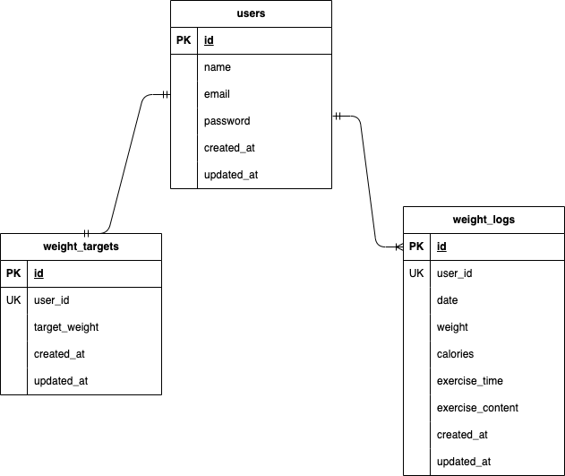

## アプリケーション名
確認テスト：PiGLy
## ER図

## 環境構築

**Dockerのビルド**  
1.リポジトリからダウンロード
git@github.com:KoumotoAkiko/koumotoAkiko-kadai_3.git

２.DockerDesktopアプリを立ち上げる 
docker-compose up -d --build

「MacのM1・M2チップのPCの場合、no matching manifest for linux/arm64/v8 in the manifest list
entties のメッセージか表示されビルドができないことがあります。エラーが発生する場合は、docker-compose.ymlファイルの
「mysql」内に「platform」の項目を追加で記載してください。」

**Laravelの環境構築**

１.Laravelをインストール 
docker-compose exec php bash

composer install

2.envファイルの作成
cp .env .example .env

3..envファイルに以下のDBの設定を変更

DB_HOST=mysql 
DB_DATABASE=laravel_db 
DB_USERNAME=laravel_user 
DB_PASSWORD=laravel_pass

4.アプリケーションキーの作成
php artisan key:generate

5.マイグレーションの実行
php artisan migrate

6.シーディングの実行
php artisan db:seed 

"The stream or file could not be opened"エラーが発生した場合
ディレクトリ/ファイルの権限を変更

$ sudo chmod -R 777 src/storage

## 使用技術
・Lalavel 8.83.8
・PHP 7.4.9
・Mysql 15.1

## URL

ログイン：http://localhost/admin/login  
初期ログインアドレス:test@example.com 
初期パスワード:password123 
新規登録：http//localhost/register/step1
